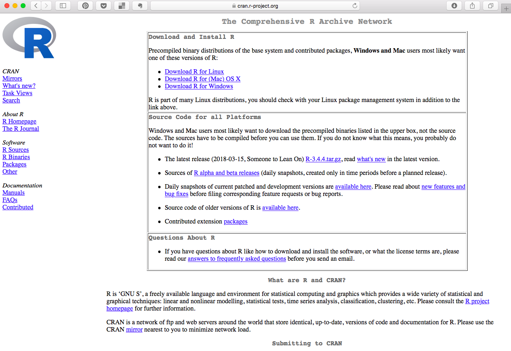
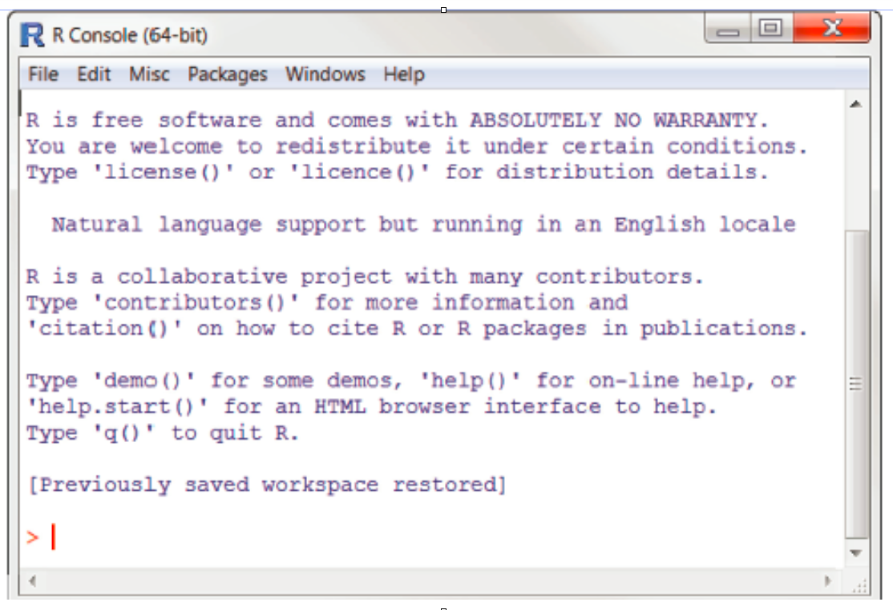
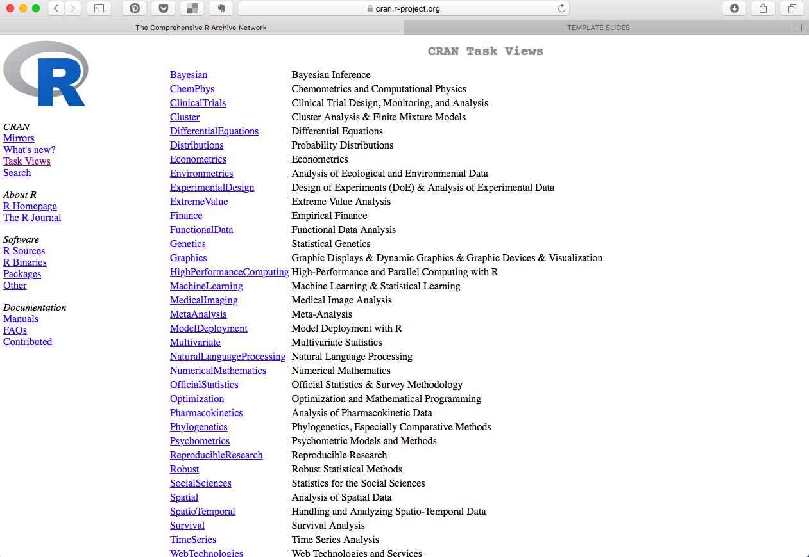
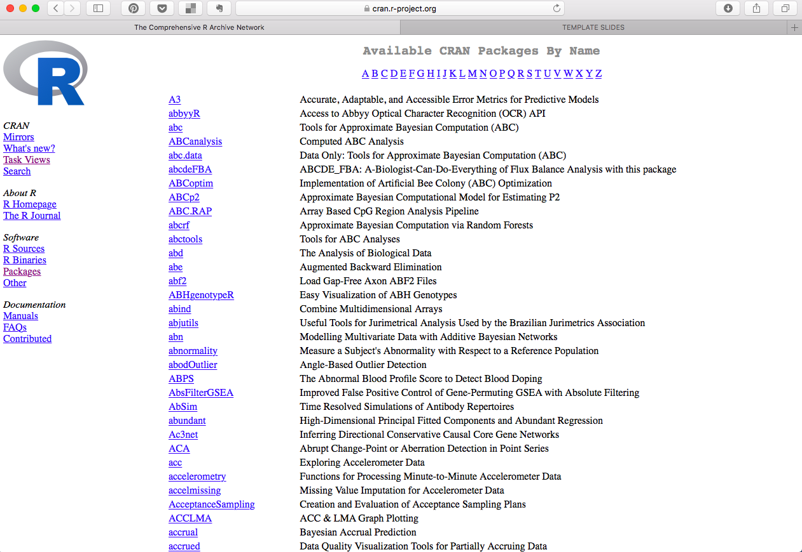
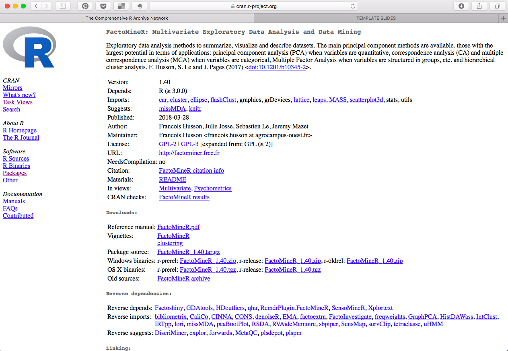
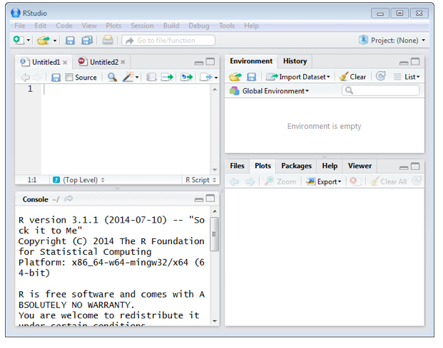

***

<a rel="license" href="http://creativecommons.org/licenses/by-nc-sa/4.0/"></a><br /><span xmlns:dct="http://purl.org/dc/terms/" property="dct:title">MSGSU ISTATISTIK BOLUMU - IST 335/s R ILE ISTATISTIKSEL PROGRAMLAMA DERS NOTLARI 2021-22 </span> by <span xmlns:cc="http://creativecommons.org/ns#" property="cc:attributionName">ozge.ozdamar@msgsu.edu.tr</span> is licensed under a <a rel="license" href="http://creativecommons.org/licenses/by-nc-sa/4.0/">Creative Commons Attribution-NonCommercial-ShareAlike 4.0 International License</a>.

Hata ve öneriler için `r emo::ji("email")`

***

**REFERENCES**

**Links**

[GITHUB](https://github.com/ozdamar/)

[R](https://cran.r-project.org)

**Cheat Sheets**

{width=700px}

***

**LIBRARIES**
```{r,warning=FALSE,message=FALSE,results='hide'}
.packages = c("RXKCD","beepr","fortunes","Rcmdr", "fun", "plotly", "magrittr", "networkD3", "dygraphs","devtools")
.inst <- .packages %in% installed.packages()
if(length(.packages[!.inst]) > 0) install.packages(.packages[!.inst])
lapply(.packages, require, character.only=TRUE)
```
***

# 1. Introduction

##  what is R?
R is a language and environment for statistical computing and graphics, 
similar to the S language originally developed at Bell Labs

## + vs -

* open source
* R has state-of-the-art graphics capabilities. If you want to visualize complex data, R has the most comprehensive and powerful feature set available
* R can have a steep learning curve.
* Three constraints on computing performance CPU, RAM, and disk I/O
* R is interpreted on the fly
* R is single-threaded
* R requires all data to be loaded into memory
* Algorithm design affects time and space complexity

## R can..
```{r,warning=FALSE,message=FALSE}
library(plotly)
library(magrittr)

mtcars$am[which(mtcars$am == 0)] <- 'Automatic'
mtcars$am[which(mtcars$am == 1)] <- 'Manual'
mtcars$am <- as.factor(mtcars$am)

p <- plot_ly(mtcars, x = ~wt, y = ~hp, z = ~qsec, color = ~am, colors = c('#BF382A', '#0C4B8E')) %>%
  add_markers() %>%
  layout(scene = list(xaxis = list(title = 'Weight'),
                     yaxis = list(title = 'Gross horsepower'),
                     zaxis = list(title = '1/4 mile time')))
p
```


```{r}
library(networkD3)
data(MisLinks, MisNodes)
forceNetwork(Links = MisLinks, Nodes = MisNodes, Source = "source",
             Target = "target", Value = "value", NodeID = "name",
             Group = "group", opacity = 0.4)
```


```{r}
library(dygraphs)
 dygraph(nhtemp, main = "New Haven Temperatures") %>%
  dyRangeSelector(dateWindow = c("1920-01-01", "1960-01-01"))
```


## download R

CRAN- The Comprehensive R Archive Network: 
https://cran.r-project.org/



## R console



##  base installiation

Base installation: base, datasets, utils, grDevices, graphics, stats,  methods ... Packages

Base package contains the basic functions which let R function as a language: arithmetic, input/output, basic programming support, etc. 

Packages are collections of R functions, data, and compiled code in a well-defined format. 

The directory where packages are stored on your computer is called the library.

```{r,eval=FALSE}
library()
```

## Task views:
https://cran.r-project.org/  >  Task Views



## cran packages
https://cran.r-project.org/  > Packages



R Home Page : https://www.r-project.org/ > Bioconductor

## package web page



## package information

**Version :**

**Depends :** 

**Imports :** packages listed here must be present for the package to work

**Suggests :** package can use these packages, but doesn't require them

**Citation :**

**Reference manual:**

**Vingette :**

**Source :**

## inside packages {.tabset .tabset-fade .tabset-pills}


### **Data**
```{r}
data()  # list of data of installed packages
data(mtcars) # load data mtcars from package datasets
mtcars # print data to screen
```

###**Functions**
```{r}
sum(mtcars$mpg)
?sum #help for function
??sum # fuzzy search for help
```

###**examples**
```{r}
example(mtcars)
```

###**demonstrations**
```{r,eval=FALSE}
demo() # list of demos of installed packages
demo(graphics)
```

###**vignettes**
```{r}
vignette() # list of vignettes of installed packages
```

###**GUI packages**
```{r,eval=FALSE}
library(Rcmdr) # Statistics  GUI
```

###**fun :)**
```{r,eval=FALSE}
library(RXKCD)
searchXKCD("programing ")
getXKCD(353)
```

```{r,eval=FALSE}
library(beepr)
beep(4)
```

```{r,eval=FALSE}
library(fortunes)
fortune()
```

```{r,eval=FALSE}
library(fun)
gomoku()
```


```{r,eval=FALSE }
library(fun)
if (interactive()) {
    if (.Platform$OS.type == "windows") 
        x11() else x11(type = "Xlib")
    sliding_puzzle()
    sliding_puzzle(z = matrix(0:11, 3, 4))
}

```

```{r,eval=FALSE}
devtools::install_github('RLesur/Rcade')
Rcade::games
Rcade::games$Pacman
```

```{r,eval=FALSE}
Rcade::games$`2048`
```


# other package sources:
help                                            | Link
-------------                                   | -------------
Microsoft R Open:latest packages                | https://mran.microsoft.com/spotlight/
Rdrr.io: Cran + bioconductor + Github + R-Forge | https://rdrr.io/all/
rOpenSci packages                               |  https://ropensci.org/packages/
RDocumentation: CRAN + BioConductor + Github    | https://www.rdocumentation.org/
AWESOME R                                       | https://awesome-r.com/
github                                          |  https://github.com/qinwf/awesome-R
METACRAN                                        | https://www.r-pkg.org/
CRANBERRIES                                     |  http://dirk.eddelbuettel.com/cranberries/
BIOCONDUCTOR                                    |  https://www.bioconductor.org/packages/release/BiocViews.html
RSTUDIO                                         | https://rviews.rstudio.com/


# for help
help            | Link
-------------   | -------------
email lists     | https://www.r-project.org/mail.html
stackoverflow   | https://stackoverflow.com/
R search engine | http://search.r-project.org/
R seek engine   | https://rseek.org/

# IDE / GUIS

IDE / GUI                          | Link
-----------------------------------|------------------------------------
**RSTUDIO**                        | https://www.rstudio.com A powerful and productive user interface for R. Works great on Windows, Mac, and Linux.
**Revolution R Enterprise**        | https://mran.microsoft.com Revolution R would be offered free to academic users and commercial software would focus on big data, large scale multiprocessor functionality.
**EMACS + ESS**                    | http://ess.r-project.org Emacs Speaks Statistics is an add-on package for emacs text editors.
**IRkernel**                       | https://github.com/IRkernel/IRkernel R kernel for Jupyter.
**StatET**                         | http://www.walware.de/goto/statet An Eclipse based IDE for R
**NOTEPAD ++**                     | https://notepad-plus-plus.org/download/v7.6.3.html
**SCIVIEWS**                       | http://www.sciviews.org
**R-BRAIN**                        | https://r-brain.io/en/
**RKWARD**                         | https://rkward.kde.org
**Radiant**                        | https://radiant-rstats.github.io/docs/ A platform-independent browser-based interface for business analytics in R, based on the Shiny
**RTVS R TOOLS FOR VISUAL STUDIO** | https://docs.microsoft.com/en-us/visualstudio/rtvs/?view=vs-2017
**TINN-R**                         | https://sourceforge.net/projects/tinn-r/
**JGR**                            | https://www.rforge.net/JGR/
**R AnalyticFlow**                 | https://r.analyticflow.com/en/
**JASP**                           | https://jasp-stats.org A complete package for both Bayesian and Frequentist methods, that is familiar to users of SPSS.
**Rattle**                         | https://rattle.togaware.com
**Vim-R**                          | https://github.com/vim-scripts/Vim-R-plugin Vim plugin for R
**Nvim-R**                         | https://github.com/jalvesaq/Nvim-R  Neovim plugin for R
**Bio7**                           | https://bio7.org A IDE contains tools for model creation, scientific image analysis and statistical analysis for ecological modelling.
**R Commender**                    | https://socialsciences.mcmaster.ca/jfox/Misc/Rcmdr/ A package that provides a basic graphical user interface.
**Deducer**                        | http://www.deducer.org/pmwiki/pmwiki.php?n=Main.DeducerManual?from=Main.HomePage A Menu driven data analysis GUI with a spreadsheet like data editor.


# RStudio



## RStudio IDE

Tools -> Global Options -> Pane Layout

### Source Editor Pane


### Environment and History Pane

### Console Pane

Command Completion: Tab
Command History Popup: Ctrl + arrow up
Clear Console : Ctrl + L
Go through historical command : arrow up


#### 

# Functions for library management
R has a workspace known as the global environment that can be used to store the results of calculations, and many other types of objects.

get working directory
```{r,eval=FALSE}
getwd()
```

set working directory
```{r,eval=FALSE}
setwd(...)
```


```{r,eval=FALSE}
dir()
```

Save history
```{r,eval=FALSE}
savehistory(file="isim.Rhistory")
loadhistory(file="isim.Rhistory")
```

quit R
```{r,eval=FALSE}
q()
```

your library's path
```{r,eval=FALSE}
# your library's path 
.libPaths()
```

list of packages in  your library
```{r, eval=FALSE}
library()
```

details of all packages installed in the specified libraries
```{r,eval=FALSE}
installed.packages()
```

list of functions in a package
```{r,eval=FALSE}
library(help = "base")
```

install packages
```{r,eval=FALSE}
install.packages("PackageName") 	# from CRAN
biocLite(PackageName)  		# from Bioconductor
Devtolls::install_github(PackageName) # fom Github
```

load packages
```{r,eval=FALSE}
library(PackageName)
require(PackageName)
```

list of loaded packages
```{r,eval=FALSE}
search()
```

directories of attached (loaded) packages
```{r,eval=FALSE}
searchpaths()
```

update library
```{r,eval=FALSE}
update.packages() 
```


# R as a calculator
```{r}
5
5+7
10.5
56/2
3*6
5-10
3^2
14/5+3
14/(5+3)
```

#   Named storage 
## variable names
In R, an object is anything that can be assigned to a variable. 
This includes constants, data structures, functions, and even graphs. Objects have a mode (which describes how the object is stored) and a class (which tells generic functions like print how to handle it).

atama operatoru ters ok isaretidir <-
```{r}
a <- 5 # my first variable :P 
a
b <- 6*8-4
b
b <- b*10 

```

## nesne isimleri:

case sensitive : A ile a farkli

Turkce karakter kullanilmamali

Rakam ile baslamamali, alfanumerik olabilir : b1, m5

imlecler: _ , .

ingilizce komut olabilecek kelimeleri nesne ismi olarak kullanilmamali (print, scan, c)

degisken isimleri icin mantik gelistiriniz:


Var_name2 : Valid - contains underscores, dot, numbers, or letters.

2var_name : Invalid - Starts with a number

Var_name% : Invalid - Contains the percentage (%) sign.  	       

.2var_name : Invalid - Starts with a dot followed by a number.

.var_name, var.name : Valid - Starts with a dot. Dot should never be followed by a number.

 _var_name : Invalid - Starts with an underscore.


# objects

```{r}
ob1 <- 54 
ob2 <- "merhaba"
ob3 <- 'F'
ob4 <- TRUE
ob5 <- F
ob6 <-c(1,4,5) # this is a vector
ob7 <- mtcars
ob8 <- 54L
```


# function for objects
```{r}
ob1 # print object to screen
print(ob1)

class(ob1)
mode(ob1)
typeof(ob1)

class(ob8)
mode(ob8)
typeof(ob8)

str(ob2) #structure of object
dim(ob2) # dimension of object
length(ob2) # length of object
names(ob2) #names of objects in avaible
summary(ob2) #
is.vector(ob1) # ask object type
as.matrix(ob1) # change object type
rm(ob1) #remove object
objects()
ls()

#remove()
#rm()
```


Object         | class()      |  mode()     |  typeof()
---------------|--------------|-------------|----------
ob1<-54        | numeric      | numeric     | double
ob2<-"merhaba" | character    | character   | character
ob3<-'F'       | character    | character   | character
ob4<-TRUE      | logical      | logical     | logical
ob5<-F         | logical      | logical     | logical
ob6<-c(1,4,5)  | numeric      | numeric     | double
ob7<-mtcars    | data.frame   | list        | list
ob8<-54L       | data.frame   | list        | list


# Operators
## 1. Assignment Operators 

* **<-**
* **=**
* **<<-**
* **->**
* **->>**	 
```{r}
v1 <- c(3,1,TRUE,2+3i)
v2 <<- c(3,1,TRUE,2+3i)
v3 = c(3,1,TRUE,2+3i)
v3
15-> v4
v4
```

http://stat.ethz.ch/R-manual/R-patched/library/base/html/assignOps.html

## 2.Logical Operators 

These are applicable to vectors that are known to be complex, numeric, or, logical. The value TRUE will be given to anything that is larger than 1. 
You will then compare the first element of the vector with the second 
vector's corresponding element.

Table       | Second Header
------      | -------------
AND         |  "&"
OR          |  "|"
NOT         |  "!"
Logical AND |  "&&" 
Logical OR  |  "||"

Operators `&` and `|` perform element-wise operation producing result having length of the longer operand. But `&&` and `||` examines only the first element of the operands resulting into a single length logical vector.

Zero is considered FALSE and non-zero numbers are taken as TRUE. 

###  `&` : AND
It is called Element-wise Logical AND operator. It combines each  element of the first vector with the corresponding element of the second vector and gives a output TRUE if both the elements are TRUE.

```{r}
x1<-c(1,2,3,4)
x1
x2<-c(10,20,30,40)
x2
x1&x2
```

```{r}
v <- c(3, 1, TRUE, 2+3i) 
v
t <- c(4, 1, FALSE, 2+3i)
t
v&t
```

### `|` : OR
It is called Element-wise Logical OR operator. It combines each element 
of the first vector with the corresponding element of the second vector 
and gives a output TRUE if one the elements is TRUE.

```{r}
x1|x2
v|t
```

### `!` : NOT
It is called Logical NOT operator. Takes each element of the vector and 
gives the opposite logical value.
```{r}
!x1
!x2
!v
!t
```

### `&&` : Logical AND
Called Logical AND operator. Takes first element of both the vectors and gives the TRUE only if both are TRUE.
```{r}
x1&&x2
v&&t
```


### `||` : Logical OR
Called Logical OR operator. Takes first element of both the vectors and gives the TRUE if one of them is TRUE.
```{r}
x1||x2
v||t
```


## 3. Relational Operators

Relational Operators are known to make comparisons between the first and second elements. With that, you''ll get Boolean values as results. 

Operator  | Meaning
----------|---
1. <	    | Less than
2. >	    | Greater than
3. <=	    | Less than or equal to
4. >=	    | Greater than or equal to
5. ==	    | Equal to
6. !=	    | Not equal to

```{r}
v <- c(2, 5.5, 6, 9) 
t <- c(8, 2.5, 14, 9)
v < t
v > t
v <= t
v >= t
v == t
v != t
```


## 4. Arithmetic Operators
Arithmetic Operators are used to carry out mathematical operations

Operator  | Meaning
----------|---
1. + 	    | Addition
2.  -	    | Subtraction
3. *	    | Multiplication
4. / 	    | Division
5. ^ 	    | Exponent
6. %% 	  | Modulus (Remainder from division)
7. %/% 	  | Integer Division
```{r}
v <- c(2, 5.5, 6)
t <- c(8, 3, 4)
v + t
v - t
v * t
v / t
v ^ t
v %% t
v %/% t
```


## 5. Miscellaneous Operators

These operators are used to for specific purpose and not general mathematical or logical computation.

operator              | meaning
----------------------|--------------------------------------------------------
 :                    | Colon operator. It creates the series of numbers in sequence for a vector.
 %in%                 | This operator is used to identify if an element belongs to a vector.
 %*%                  | This operator is used to multiply matrices

```{r}
v1 <- 8
v2 <- 12
t <- 1:10
```

```{r}
v1 %in% t
v2 %in% t
```

```{r}
M = matrix(1:6, nrow = 2,ncol = 3,byrow = TRUE)
t = M %*% t(M)
t
```


#   Workspace  functions  #

```{r, eval=FALSE}
getwd()
setwd()
ls()
rm()
help(options)
options()
history()
savehistory()
load(history)
save.image()
save(...)
load()
q
```

#   HELP   #

```{r,eval=FALSE}
help.start()
help(sum) # or
?sum
help.search(sum) # or
??sum
example(sum)
RSiteSearch("sum")
apropos("sum", mode="function")
data()
demo()
vignette()
vignette("sum")
```


# Special Numbers  {.tabset .tabset-fade .tabset-pills}


**NA :** Not Available

**NaN :** Not a Number

**Inf :** Infinity

**-Inf :** Negative Infinity

## `NA`

In R, the NA values (Not available) are used to represent missing values. 
```{r}
x1<-NA
x1
```

```{r}
is.na(x1) # returns TRUE of x is missing
is.nan(x1)
is.finite(x1)
is.infinite(x1)
class(x1)
```

## `NAN`

Sometimes, a computation will produce a result that makes little sense. In these cases, R will often return NaN (meaning “not a number”)
```{r}
x2<-0/0
x2
```


```{r}
is.na(x2)
is.nan(x2)
is.finite(x2)
is.infinite(x2)
class(x2)
```

```{r}
Inf - Inf
```


## `Inf`
If a computation results in a number that is too big, R will return Inf for a positive number and -Inf for a negative number.This is also the value returned when you divide by 0:
```{r}
x3a<-10/0
x3a
```

```{r}
is.na(x3a)
is.nan(x3a)
is.finite(x3a)
is.infinite(x3a)
class(x3a)
```


```{r}
 2 ^ 1024
```

## `-Inf
```{r}
x3b <- -10/0
x3b
```


```{r}
is.na(x3b)
is.nan(x3b)
is.finite(x3b)
is.infinite(x3b)
class(x3b)
```

```{r}
 -2 ^ 1024
```


## NULL

NULL is often used to explicitly define an “empty” entity, which is quite different from a “missing” entity specified with NA.

NULL is often used as an argument in functions to mean that no value was assigned to the argument. Additionally, some functions may return NULL.

```{r}
x1<-NULL
x1
x2<-NA # NA is with index number
x2
```

```{r}
x1<-c(2,5,NA,6)
x1
length(x1)
x2<-c(2,5,NULL,6)
x2
length(x2)
```

```{r}
NULL+5
NA +5
```

```{r}
5<=NULL
```


