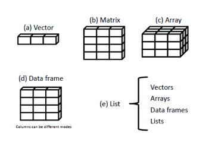
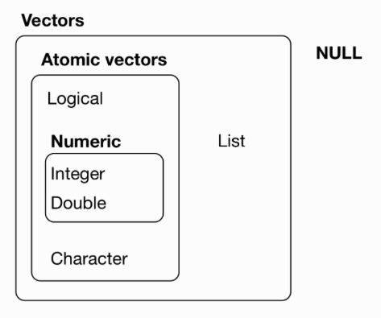
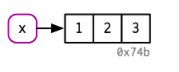
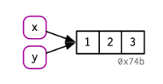
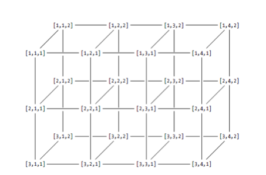
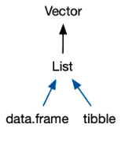

```{r, eval=FALSE, echo=FALSE}

```

***
<a rel="license" href="http://creativecommons.org/licenses/by-nc-sa/4.0/"></a><br /><span xmlns:dct="http://purl.org/dc/terms/" property="dct:title">İSTANBUL KÜLTÜR ÜNİVERSİTESİ - MB0072 NESNE YÖNELİMLİ PROGRAMLAMA1</span> by <span xmlns:cc="http://creativecommons.org/ns#" property="cc:attributionName">ozge.ozdamar@msgsu.edu.tr</span> is licensed under a <a rel="license" href="http://creativecommons.org/licenses/by-nc-sa/4.0/">Creative Commons Attribution-NonCommercial-ShareAlike 4.0 International License</a>.

Hata ve öneriler için `r emo::ji("email")`

***

**REFERENCES**

**Links**

[Advanced R](https://adv-r.hadley.nz)

**Cheat Sheets**

{width=700px}

{width=700px}

{width=700px}

{width=700px}

{width=700px}

{width=700px}

{width=700px}

{width=700px}

***
**LIBRARIES**
```{r,warning=FALSE,message=FALSE,results='hide'}
.packages = c("pryr","lobstr")
.inst <- .packages %in% installed.packages()
if(length(.packages[!.inst]) > 0) install.packages(.packages[!.inst])
lapply(.packages, require, character.only=TRUE)
```

***
# Data Types

## Character
```{r}
VC<-"merhaba"
VC
```


```{r}
class(VC)
typeof(VC)
mode(VC)
storage.mode(VC)
str(VC)
attributes(VC)
object.size(VC) # utils package
lobstr::obj_size(VC) # lobstr package
tracemem(VC) # base package
lobstr::obj_addr(VC) 
```

```{r}
is.vector(VC)
```

## Numeric (real or decimal)

```{r}
VN1<-5
VN2<-5.5
VN1
VN2
```

```{r}
class(VN1)
class(VN2)
typeof(VN1)
typeof(VN2)
mode(VN1)
mode(VN2)
storage.mode(VN1)
storage.mode(VN2)
str(VN1)
str(VN2)
attributes(VN1)
attributes(VN2)
object.size(VN1)
object.size(VN2)
lobstr::obj_size(VN1)
lobstr::obj_size(VN2)
tracemem(VN1)
tracemem(VN2)
lobstr::obj_addr(VN1)
lobstr::obj_addr(VN2) 
```

## Logical

```{r}
VL<-TRUE
VL
```

```{r}
class(VL)
typeof(VL)
mode(VL)
storage.mode(VL)
str(VL)
attributes(VL)
object.size(VL)
lobstr::obj_size(VL)
tracemem(VL)
lobstr::obj_addr(VL)
```
## Integer

```{r}
VI<-5L
VI
```


```{r}
class(VI)
typeof(VI)
mode(VI)
storage.mode(VI)
str(VI)
attributes(VI)
object.size(VI)
lobstr::obj_size(VI)
tracemem(VI)
lobstr::obj_addr(VI)
```

## Complex number

```{r}
VCN<-5+2i
VCN
```

```{r}
class(VCN)
typeof(VCN)
mode(VCN)
storage.mode(VCN)
str(VCN)
attributes(VCN)
object.size(VCN)
lobstr::obj_size(VCN)
tracemem(VCN)
lobstr::obj_addr(VCN)
```

## Raw data(byte)
```{r}
VR <-charToRaw("merhaba") # Raw
VR
```

```{r}
class(VR)
typeof(VR)
mode(VR)
storage.mode(VR)
str(VR)
attributes(VR)
object.size(VR)
lobstr::obj_size(VR)
tracemem(VR)
lobstr::obj_addr(VR)
```

# Data Structures

Variables are nothing but reserved memory locations to store values. This means that, when you create a variable you reserve some space in memory.

You may like to store information of various data types like character, wide character, integer, floating point, double floating point, Boolean etc. Based on the data type of a variable, the operating system allocates memory and decides what can be stored in the reserved memory.

However, one difference of R Programming to other programming languages, such as Java and C, is the fact that variables need not be necessarily declared as data types. The variables are assigned with R-Objects and the data type of the R-object becomes the data type of the variable. R data types are:

***

object      | nesne           |
------------|-----------------|------------------------------------------------
 Vector     |  vektör         | ayni tiple bilgi içeren en küçük nesne
 Array      |  dizi           | birden fazla boyutta bilgi içeren nesne
 Matrice    |  matris         | matris. matris aynı tipte ve uzunlukta bilgi içerir ve  zamanda 2 boyutlu array dir
 Data.frame |  veri seti      | farklı tipte bilgi(numeric, character,factor) içerebilen nesne
 Factor     |  faktör         | kategorik değişkenler için kullanılır 
 List       |  liste          | farkli tipte nesneleri barindirabilen nesne
 ts         |  zaman serisi   | zaman serisi
 




* ps: R'da bu temel nesne tiplerinden başka farklı amaçlar için oluşturulmuş nesneler de vardır. İlgili paketlerin yüklenmesiyle bu nesneler ile çalışabiliriz.

## Vector

The basic data structure in R is the vector.There are two types of vectors

* **Atomic vectors:** logical, integer, double, character, complex, and raw. Integer and double vectors are collectively known as numeric vectors.

* **Lists:** which are sometimes called recursive vectors because lists can contain other lists.

Atomic vectors are homogeneous, while lists can be heterogeneous.

There’s one other related object: NULL. NULL is often used to represent the absence of a vector (as opposed to NA, which is used to represent the absence of a value in a vector). NULL typically behaves like a vector of length 0.





Vectors have three common properties:

* **Type:** `typeof()`, what it is.
* **Length:** `length()`, how many elements it contains.
* **Attributes:** `attributes()`, additional arbitrary metadata.


vectors contain the same type / mode values 

scaler values are vectors with only one element.


Basic information of any kind of objects in R can be gathered with  `mode()`, `class()`, `typeof()`, `storage.mode()`, `attributes()` functions.

**`mode`** is a mutually exclusive classification of objects according to their basic structure. The 'atomic' modes are numeric, complex, character and logical. Recursive objects have modes such as 'list' or 'function' or a few others. An object has one and only one mode.

For the numeric mode, R stores all numeric objects into either a 32-bit integer or a double-precision floating point.

If an R object contains both numeric and logical elements, the mode of that object will be numeric and, in this case, the logical element automatically gets converted to a numeric element. The logical element TRUE converts to 1 and FALSE converts to 0. On the other hand, if any R object contains a character element, along with both numeric and logical elements, it automatically converts to the character mode.

**`class` **is a property assigned to an object that determines how generic functions operate with it. It is not a mutually exclusive classification. If an object has no specific class assigned to it, such as a simple numeric vector, it's class is usually the same as its mode, by convention.

Changing the mode of an object is often called 'coercion'. The mode of an object can change without necessarily changing the class.

http://www.diegobarneche.com/2014-12-11-ufsc/lessons/01-intro_r/data-structures.html

**examples**
```{r}
x <- c(1,2,3)
x
class(x)
mode(x)
typeof(x)
storage.mode(x)
attributes(x)
object_size(x)
tracemem(x)
length(x)
is.vector(x)
```



```{r}
y<-x
y
```


```{r}
tracemem(x)
tracemem(y)
```

These identifiers are long, and change every time you restart R.


```{r}
y[3]<-4
```



```{r}
tracemem(x)
tracemem(y)
```

This behaviour is called copy-on-modify. 


### Vector Types {.tabset .tabset-fade .tabset-pills}

#### Locigal vector

```{r}
v.logical1 <- c(TRUE,F,T,FALSE)
v.logical2 <- c(T,FALSE,F,T)
v.logical1
class(v.logical1)
typeof(v.logical1)
mode(v.logical1)
```

Logical vectors are usually constructed with comparison operators.

```{r}
1:10 >= 5
```

```{r}
!(1:10 >= 5)
```

```{r}
1:10 %% 3 == 0
```

`any()` is at least one of the values true
```{r}
any(v.logical1)
any(v.logical2)
```

`all()` are all of the values true
```{r}
all(v.logical1)
all(v.logical2)
```

```{r}
v.logical1 & v.logical2
```

```{r}
v.logical1 | v.logical2
```


**understanding logical vectors / operators**
```{r}
x <- c(TRUE, FALSE, NA) 
xy <- expand.grid(x = x, y = x) 
within(xy,{ 
and <- x & y
or <- x | y
not.y <- !y
not.x <- !x
}
)
```

#### Integer vector

Integer and double vectors are known collectively as numeric vectors. In R, numbers are doubles by default. To make an integer, place a L after the number

```{r}
v.integer <- c(1L,2L,4L)  # Integer :: This indicates the values of OL, 2L, 34L.
v.integer
class(v.integer)
typeof(v.integer)
mode(v.integer)
```

####  Double vector

```{r}
v.double <- c(1,2,4.5)
v.double
class(v.double)
typeof(v.double)
mode(v.double)
```

The distinction between integers and doubles:

Doubles are approximations. Doubles represent floating-point numbers that cannot always be precisely represented with a fixed amount of memory. This means that you should consider all doubles to be approximations.

```{r}
s1<-c(10L,11L)
s2<-c(10,11)
```

```{r}
typeof(s1)
typeof(s2)
object.size(s1)
object.size(s2)
s3<-as.integer(s2)
object.size(s3)
```


```{r}
x <- sqrt(2) ^ 2
x
x - 2
```

This behavior is common when working with floating-point numbers: most calculations include some approximation error. Instead of comparing floating-point numbers using `==`, you should use `dplyr::near()`, which allows for some numerical tolerance.


Integers have one special value, `NA`, while doubles have four, `NA`, `NaN`, `Inf`, and `-Inf`. All three special values can arise during division

```{r}
c(-1, 0, 1) / 0
```

Avoid using `== `to check for these other special values. Instead use the helper functions `is.finite()`, `is.infinite()`, and `is.nan()`

#### Character vector

Character vectors are the most complex type of atomic vector, because each element of a character vector is a string, and a string can contain an arbitrary amount of data.

R uses a global string pool. This means that each unique string is only stored in memory once, and every use of the string points to that representation. This reduces the amount of memory needed by duplicated strings.

```{r}
v.char1 <-"M" # same 'M'
v.char1
class(v.char1)
typeof(v.char1)
mode(v.char1)
```

```{r}
object.size(v.char1)
v.char2<-rep(v.char1,100)
object.size(v.char2)
```

`v.char2` doesn’t take up 100x as much memory as `v.char1`, because each element of `v.char2` is just a pointer to that same string. A pointer is 8 bytes.

#### Complex vector
```{r}
v.complex <- c(2+5i,1+2i) # Complex
v.complex
class(v.complex)
typeof(v.complex)
mode(v.complex)
```

#### Raw vector
```{r}
v.raw <-charToRaw("merhaba") # raw
v.raw
class(v.raw)
typeof(v.raw)
mode(v.raw)
```

Missing values are specified with `NA`, which is a logical vector of length 1. `NA` will always be coerced to the correct type if used inside `c()`, or you can create `NA`s of a specific type with `NA_real_` (a double vector), `NA_integer_` and `NA_character_`.

* Note that each type of atomic vector has its own missing value
```{r}
NA             # logical
NA_integer_    # integer
NA_real_       # double
NA_character_  # character
```

Normally you don’t need to know about these different types because you can always use `NA` and it will be converted to the correct type using the implicit coercion rules described next. However, there are some functions that are strict about their inputs, so it’s useful to have this knowledge sitting in your back pocket so you can be specific when needed.


NB: `is.numeric()` is a general test for the “numberliness” of a vector and returns `TRUE` for both integer and double vectors. It is not a specific test for double vectors, which are often called numeric.

***

### Creating vector

**concatenating data to create vectors**

concatenate is a Latin word meaning connect together in a chain  `c()`
```{r}
a1 <- c(1,2,3,4,5,6,7,8,9,10)
a1
```


create sequantial vectors with `:`, `rep()` and `seq()`
```{r}
a1 <- 1:10
a1
```

```{r}
seq(from = 1, to = 10, by = 2)
```

```{r}
seq(from = 1, to = 10, length.out =6) # lenght=6
```


```{r}
seq(3, 0, -1)
```


```{r}
rep(1, 5)
```

```{r}
rep(c(1,2), 5)
```

```{r}
rep(c(1,2), each=5) #?rep
```


```{r}
isim <- c("D1", "D2", "D3") # char vector
```

```{r}
rep(isim,each=10)
```

```{r}
rep(isim,10)
```

```{r}
(v1 <- 1:10)
(v2 <- c(11:13,NA,15:17,NA,19,20)) # with missing values
(v3 <- seq(1,100,10))
```

binding vectors
```{r}
V1<-c(v1,v2,v3) 
V1
```

```{r}
sum(v2)
sum(v2, na.rm=TRUE) #? ve ?? 
```

cbind (COLUMN BIND)
```{r}
V2<-cbind(v1,v2,v3)
V2
class(V2)
dim(V2)
```

rbind (ROW BIND)
```{r}
V3<-rbind(v1,v2,v3)
V3
dim(V3)
```


```{r}
(a1 <- numeric(10))
```

```{r}
(a1[10] <- 10)
```


```{r}
(a2<-vector(length=5))
```

```{r}
a2[2:3]<-40
a2
```

###  Vector coercion

All elements of an atomic vector must be the same type, so when you attempt to combine different types they will be coerced to the most flexible type. Types from least to most flexible are: logical, integer, double, and character.


When a logical vector is coerced to an integer or double, `TRUE` becomes 1 and `FALSE` becomes 0. This is very useful in conjunction with `sum()` and `mean()`

Coercion often happens automatically. Most mathematical functions (`+`, `log`, `abs`, etc.) will coerce to a double or integer, and most logical operations (`&`, `|`, `any`, etc) will coerce to a logical. You will usually get a warning message if the coercion might lose information. If confusion is likely, explicitly coerce with `as.character()`, `as.double()`, `as.integer()`, or `as.logical()`.

explicit coercion:

implicit coercion: 


verb                   | lgl | int | dbl | chr | list 
-----------------------|-----|-----|-----|-----|-----------------------------
**`is_logical()`**     |  x  |     |     |     |      
**`is_integer()`**     |     |  x  |     |     |      
**`is_double()`**      |     |     |  x  |     |      
**`is_numeric()`**     |     |  x  |  x  |     |      
**`is_character()`**   |     |     |     |  x  |      
**`is_atomic()`**      |  x  |  x  |  x  |  x  |      
**`"is_list()`**       |     |     |     |     |      
**`is_vector()`**      |  x  |  x  |  x  |  x  |  x   

NB: `is.vector()` does not test if an object is a vector. Instead it returns `TRUE` only if the object is a vector with no attributes apart from names. Use `is.atomic(x)` || `is.list(x)` to test if an object is actually a vector.

Atomic vectors are always flat, even if you nest `c()`’s:
```{r}
c(1, c(2, c(3, 4)))
c(1, 2, 3, 4)
```

### Vector subsetting
You can refer to elements of a vector using a numeric vector of positions within brackets. (indexing, subscripting or slicing)


* Passing a vector of positive numbers returns the slice of the vector containing the elements at those locations. The first position is 1 (not 0, as in some other languages).

* Passing a vector of negative numbers returns the slice of the vector containing the elements everywhere except at those locations.

* Passing a logical vector returns the slice of the vector containing the elements where the index is TRUE.

* For named vectors, passing a character vector of names returns the slice of the vector containing the elements with those names.

```{r}
v1[4]
```

```{r}
v1[3:7]
```

```{r}
v1[c(2,4)]
```

```{r}
v1[-3]
```

same values:
```{r}
x <- (1:5) ^ 2
x[c(1, 3, 5)]
x[c(-2, -4)]
x[c(TRUE, FALSE, TRUE, FALSE, TRUE)]
```

```{r}
names(x) <- c("one", "four", "nine", "sixteen", "twenty five")
x[c("one", "nine", "twenty five")]
```


```{r}
# x[c(1, -1)]
```
If you use positive numbers or logical values as the index, then missing indices corre‐ spond to missing values in the result:

```{r}
x[c(1, NA, 5)]
```


```{r}
x[c(TRUE, FALSE, NA, FALSE, TRUE)]
```
Missing values don’t make any sense for negative indices, 
```{r}
# x[c(-2, NA)]
```

```{r}
x[6]
```
```{r}
x[1.9]
```
```{r}
x[-1.9]
```

```{r}
x[ ]
```
The `which()` function returns the locations where a logical vector is TRUE. This can be useful for switching from logical indexing to integer indexing:
```{r}
which(x > 10)
```

```{r}
which.min(x)
```

```{r}
which.max(x)
```

**exercises**
```{r, results="hide"}
V2
```

```{r, results="hide"}
V2[,1]
```

```{r, results="hide"}
V2[1:5,1]
```


```{r, results="hide"}
V2[2,]
```


```{r, results="hide"}
V2[2,2:3]
```


```{r, results="hide"}
V2[,-2]
```


```{r, results="hide"}
V2[c(1,3,5,7),]
```


```{r, results="hide"}
V2[,c(-1,-3)]
```


```{r, results="hide"}
V2[,c(-1,-3)]
```


```{r, results="hide"}
# V2[2,2:5]
```


```{r}
dim(V2) # dimension
Satir.Sayisi<- dim(V2)[1]
Satir.Sayisi
Sutun.Sayisi<-dim(V2)[2]
Sutun.Sayisi
```


```{r}
# edit(V2)
# fix(V2)
```

### more vectors

```{r}
vector("numeric", 5)
```

```{r}
vector("complex", 5)
```

```{r}
vector("logical", 5)
```

```{r}
vector("character", 5)
```

```{r}
vector("list", 5)
```
NULL is a special “empty” value (not to be confused with NA, which indicates a missing data point)

wrapper functions:
```{r}
numeric(5)
```

```{r}
complex(5)
```

```{r}
logical(5)
```

```{r}
character(5)
```

```{r}
list(5) # list does not work the same way!!
```

**sequences**
```{r}
seq.int(3, 12) #same as 3:12
```

```{r}
seq.int(3, 12, 2)
```


```{r}
seq.int(0.1, 0.01, -0.01)
```


```{r}
seq_len(5) # 1:5
```


seq_along creates a sequence from 1 up to the length of its input:

```{r}
egitim<- c("Akademik", "Bilişim", "2019", "R", "ile", "ileri", "veri", "önişleme")
for(i in seq_along(egitim)) print(egitim[i])
```

**lenght**
```{r}
length(1:5)
```

```{r}
length(c(TRUE, FALSE, NA))
```

```{r}
length(egitim) # char vectors 
```

```{r}
nchar(egitim)
```


**names**

```{r}
c(elma = 1,muz = 2, "kivi" = 3, 4)
```

```{r}
x <- 1:4
names(x) <- c("elma", "muz", "kivi", "")
x
```


```{r}
names(x)
```
If a vector has no element names, then the names function returns NULL:
```{r}
names(1:4)
```

### Recycling

If we try to add a single number to a vector, then that number is added to each element of the vector:
```{r}
 1:5 + 1
```
```{r}
1 + 1:5
```

When adding two vectors together, R will recycle elements in the shorter vector to match the longer one:
```{r}
1:5 + 1:15
```

```{r}
 1:5 + 1:7
```

```{r}
rep(1:5, 3)
```

```{r}
rep(1:5, each = 3)
```

```{r}
rep(1:5, times = 1:5)
```

```{r}
rep(1:5, length.out = 7)
```

Like the seq function, rep has a simpler and faster variant, rep.int, for the most common case:
```{r}
rep.int(1:5, 3) #the same as rep(1:5, 3)
```

Recent versions of R (since v3.0.0) also have rep_len, paralleling seq_len, which lets us specify the length of the output vector:
```{r}
rep_len(1:5, 13)
```

```{r}

```


## Matrix

* Adding a dim attribute to an atomic vector allows it to behave like a multi-dimensional array.

* A special case of the array is the matrix, which has two dimensions. Matrices are used commonly as part of the mathematical machinery of statistics. Arrays are much rarer, but worth being aware of.

* Matrices and arrays are created with 
 `matrix()` and 
 `array()`, or 
 by using the assignment form of `dim()`

* A matrix is a two-dimensional array where each element has the same mode (numeric,character, or logical). 


<style>
div.blue pre { background-color:lightblue; }
div.blue pre.r { background-color:lightbblue; }
</style>

<div class = "blue">
```{r,eval=FALSE}
myymatrix <- matrix(vector, nrow=number_of_rows, ncol=number_of_columns,
             byrow=logical_value, dimnames=list(
             char_vector_rownames, char_vector_colnames))
```
</div>

### Creating a matrix
```{r}
A <- matrix(data = c(1,2,3,4,5,6,7,8), nrow = 2, ncol = 4) # or
A <- matrix(1:8,2,4)
A
```


```{r}
class(A)
mode(A)
typeof(A)
attributes(A)
str(A)
is.matrix(A)
is.array(A)
is.vector(A)
```

**matrix filling direction**
```{r}
matrix(data = c(1,2,3,4,5,6), nrow = 2, ncol = 3, byrow = FALSE) # default
matrix(1:6, 2, 3, byrow = TRUE)
```

row / column bindings
```{r}
rbind(1:3,4:6)
cbind(c(1,4),c(2,5),c(3,6))
rbind(c(1,3,4),5:3,c(100,20,90),11:13)
```


```{r}
dim(A)
dim(A)[2]
nrow(A)
ncol(A)
```

```{r}
colnames(A)<-c("D1","D2","D3","D4")
A
rownames(A)<-c("OCAK","SUBAT")
A
is.matrix(A)
# as.matrix() # convert to matrix
```

### Matrix subsetting
```{r, results="hide"}
A[2,3]
```

```{r, results="hide"}
A[,2]
```

```{r, results="hide"}
A[1,]
```

```{r, results="hide"}
#A[2:3,]
```

```{r, results="hide"}
A[,c(3,1)]
```

```{r, results="hide"}
diag(A)
```

```{r, results="hide"}
A[,-2]
```

```{r, results="hide"}
A[-1,3:2]
```

```{r, results="hide"}
A[-1,-2]
```

```{r, results="hide"}
A[-1,-c(2,3)]
```

```{r, results="hide"}
B <- t(A)
```

```{r, results="hide"}
B[,2] <- 1:4
```

```{r, results="hide"}
B[c(1,3),2] <- 900
```

```{r, results="hide"}
B[c(1,3),c(1,2)] <- c(-7,7)
```

```{r, results="hide"}
B[c(1,3),2:1] <- c(65,-65,88,-88)
```


### Matrix Operations
```{r}
A1 <- rbind(c(2,5,2), c(6,1,4), c(3,54,67))
B1 <- cbind(c(-2,3,6), c(8.1,8.2,-9.8))
```

#### Element-wise Matrix Operations 

##### Matrix subtraction

##### Matrix addition

##### Matrix sweep

#### Matrix-wise Operations

##### Transposition
```{r}
t(A1)
t(t(A1))
```

##### Matrix multiplication
```{r}
A1%*%B1
```

```{r, eval=FALSE}
B1%*%A1
```

##### outher/cross prouct of matrix an arrays**
```{r}
A1%o%B1
```

##### Matrix Inversion
```{r}
solve(A1)
```

```{r}
A1%*%solve(A1) 
```

```{r}
# data.entry(A1)
```

###### Determinant

Only square matrices have a determinant. This can be used to test whether the vectors in the matrix are linearly independent of one another, which means that no vector can be written as a combination of other vectors. If the vectors are linearly dependent then there are two important consequences:

- There is redundancy of information

- The matrix cannot be inverted

```{r}
det(A1)
```
The fact that a determinant is not equal to zero implies that the vectors in the c matrix are linearly independent (and therefore this matrix can be inverted).


**identitiy matrix**
```{r}
AI <- diag(x=3)
AI
```

```{r}
a <- -2
a*A1
```

```{r}
A1-AI
```

```{r, eval=FALSE}
A1*B1
```


** col and row sums**
```{r}
colSums(A1)
rowSums(A1)
```


** col and row means**
```{r}
colMeans(A1)
rowMeans(A1)
```

**lower triangle of a matrix**
```{r}
lower.tri(A1)
```


### matrix decomposition

#### QR decomposition

#### eigenvalue decomposition

#### cholesky decomposition

## Array 

Arrays are similar to matrices but can have more than two dimensions. 
Amatrix is considered to be a collection of vectors of equal length, a three-dimensional array can be considered to be a collection of equally dimensioned matrices

### Creating array
<style>
div.blue pre { background-color:lightblue; }
div.blue pre.r { background-color:lightbblue; }
</style>

<div class = "blue">
```{r,eval=FALSE}
myarray <- array(vector, dimensions, dimnames)
```
</div>




```{r}
AR <- array(data=1:24,dim=c(3,4,2))
AR
```

```{r}
BR <- array(data=rep(1:24,times=3),dim=c(3,4,2,3))
BR
```


### Subsetting array

```{r, results="hide"}
AR[2,,2]
```

```{r, results="hide"}
AR[2,c(3,1),2]
```

```{r, results="hide"}
AR[1,,]
```

```{r, results="hide"}
BR[2,1,1,3]
```


```{r, results="hide"}
BR[1,,,1]
```

```{r, results="hide"}
BR[,,2,]
```


```{r, results="hide"}
BR[3:2,4,,]
```


```{r, results="hide"}
BR[2,,1,]
```

### calculation across array elemets: apply function

<style>
div.blue pre { background-color:lightblue; }
div.blue pre.r { background-color:lightbblue; }
</style>

<div class = "blue">
```{r,eval=FALSE}
apply(x, margin, fun)
```
</div>

* x : an array
* margin : name of the data set
* fun : function to be applied across the elements of the array

```{r}
apply(AR,1,sum) # calculate the sum of the rows across all the matrices, 1:row, 2:column
```

```{r}
apply(AR,c(1,2),sum)
```
advanced subsetting: http://adv-r.had.co.nz/Subsetting.html


##  Data.frame

A data frame is a named list of vectors with attributes for (column) names, row.names, and its class, “data.frame”:

data.frame de  numerik, string ve faktorler (kategorik degiskenler) bulunabilir.

A tibble is modern version of data.frame



### Creating data.frame
```{r}
DF1<-data.frame(D1 = v1, D2 = v2, D3 = v3)
DF1
```

```{r}
class(DF1)
mode(DF1)
typeof(DF1)
```

```{r}
attributes(DF1)
```


```{r}
names(DF1)
rownames(DF1)
colnames(DF1)
```


```{r}
str(DF1)
```


```{r}
is.matrix(DF1)
is.data.frame(DF1)
is.list(DF1)
```


```{r}
ncol(DF1) # number of columns
nrow(DF1) # number of rows
length(DF1) # number of columns
dim(DF1)  # dimension
```

```{r}
head(DF1)
head(DF1, 10)
tail(DF1)
tail(DF1, 10)
```

```{r}
DF2<-data.frame(X1 = sqrt(v1), X2 = v2 + v3)
```

```{r}
DF3<- data.frame( x = 1:3, y = c("a", "b", "c"))
DF3
```

```{r}
str(DF3)
```

Default conversion of strings to factors.

```{r}
DF3<- data.frame( x = 1:3, y = c("a", "b", "c"), stringsAsFactors = FALSE)
str(DF3)
```


### Subsetting data.frame

```{r}
data(mtcars)
data(ToothGrowth)

str(mtcars) #structure
str(ToothGrowth)

head(mtcars)
head(ToothGrowth,10)
```

```{r}
mtcars$mpg
```

```{r}
mtcars[,1]
```

```{r}
attach(mtcars)
mpg
detach(mtcars)
```

### Coercion

```{r, eval=FALSE}
is.data.frame()
is_tibble()
as.data.frame()
as_tibble()
```


## List  

Lists are a step up in complexity from atomic vectors, because lists can contain other lists. This makes them suitable for representing hierarchical or tree-like structures

<style>
div.blue pre { background-color:lightblue; }
div.blue pre.r { background-color:lightbblue; }
</style>

<div class = "blue">
```{r,eval=FALSE}
list(...)
pairlist(...)
as.list(x, ...)
```
</div>

### Creating list
```{r}
L1 <- list(1, 2, 3)
L1
```

```{r}
str(L1)
```


The `typeof()` a list is list. You can test for a list with `is.list()` and coerce to a list with `as.list()`. You can turn a list into an atomic vector with `unlist()`. If the elements of a list have different types, `unlist()` uses the same coercion rules as `c()`.

Lists are used to build up many of the more complicated data structures in R. For example, both data frames  and linear models objects (as produced by `lm()`) are lists:

```{r}
L2 <- list(1:10, c("Adana", "Bursa", "Mersin"), rnorm(10))
L2
```

```{r}
names(L1) <- c("listinteger", "listcharacter", "listnumeric")
length(L1)
length(L1$listinteger)
```

```{r}
L3 <- list(matrix(data=1:4,nrow=2,ncol=2),c(T,F,T,T),"hello")
length(x=L2)
```


### Subsetting list

```{r}
L3[[1]]
L3[[1]] + 5.5

L3
L3[[1]][1,2]
L3[[1]][2,]

cat(L3[[3]],"you!")

L3[[3]]
L3[[3]] <- paste(L3[[3]],"you!")

L3[[c(2,2)]]

names(L3) <- c("mymatrix","mylogicals","mystring")
L3$mymatrix
L3[[1]]

all(L3$mymatrix[,2]==L3[[1]][,2])

```


```{r}
L4 <- list(A1=c(L3[[2]],T,T,T,F), A2 = "AB2019",A3 = L3$mymatrix*2)
names(L4)
L4
```

```{r}
L4$A4 <- L3 # add list to list
L4
names(L4)
```

```{r}
L4$A4$mylogicals[1:3] # -o-o-
```

```{r}
L4[[4]][[2]][1:3]
```

```{r}
L4[[4]]$mylogicals[1:3]
```


##  Factor 


Nominal and ordinal variables are stored and treated specially in R.
Factors are  integer! vectors where each integer has a label. They sometimes behave like strings,and sometimes like integers

<style>
div.blue pre { background-color:lightblue; }
div.blue pre.r { background-color:lightbblue; }
</style>

<div class = "blue">
```{r,eval=FALSE}
factor(x = character(), levels, labels = levels,
       exclude = NA, ordered = is.ordered(x), nmax = NA)
```
</div>


### Creating factor

**from character vector**
```{r}
x<-c("bir","iki","üç","dört","beş")
as.factor(x)
```

**from numeric vector**
```{r}
x<-c(1,2,2,1,3,1,3,2,1,1)
as.factor(x)
```

**from logical vector**
```{r}
x<- c(F,F,T,F,F,T)
as.factor(x)
```


```{r}
F1 <- factor(c("Small", "Small", "Medium","Large","Small", "Large"))
F1
```

By default, factor levels for character vectors are created in alphabetical order.
```{r}
F1.2 <- factor(c("Small", "Small", "Medium","Large","Small", "Large"),ordered=TRUE)
F1.2
```


```{r}
F1.3 <- factor(c("Small", "Small", "Medium","Large","Small", "Large"), ordered=TRUE, levels=c("Small","Medium","Large"))
F1.3
```


```{r}
class(F1)
typeof(F1)
mode(F1)
str(F1)
F1[3]
unclass(F1)
```

```{r}
levels(F1)
```

```{r}
summary(F1)
```

```{r}
table(F1)
```

```{r}
attributes(F1)
```


##  Time series


Time series are created with  `ts()` function of base installation. For working with  irregular time series and  advanced manipulation, additional packages are needed.

### Creating ts
<style>
div.blue pre { background-color:lightblue; }
div.blue pre.r { background-color:lightbblue; }
</style>

<div class = "blue">
```{r,eval=FALSE}
ts(data = NA, start = 1, end = numeric(), frequency = 1,
   deltat = 1, ts.eps = getOption("ts.eps"), class = , names = )
as.ts(x, ...)
is.ts(x)
```
</div>


```{r}
ts(1:10, frequency = 4, start = c(2018, 2))
```

```{r}
ts1 <- ts(matrix(rnorm(300), 100, 3), start = c(2010, 1), frequency = 12)
head(ts1)
```

```{r}
class(ts1)
```

```{r}
plot(ts1)
```

```{r}
plot(ts1, plot.type = "single", lty = 1:3)
```

```{r}
data(Nile)
Nile
```


