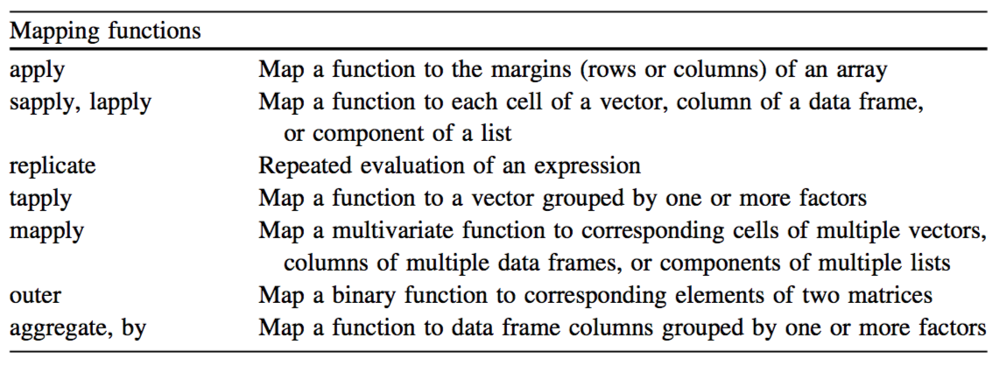
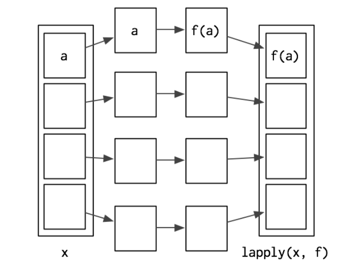

***
<a rel="license" href="http://creativecommons.org/licenses/by-nc-sa/4.0/"></a><br /><span xmlns:dct="http://purl.org/dc/terms/" property="dct:title">MSGSU ISTATISTIK BOLUMU - R ILE ISTATISTIKSEL PROGRAMLAMA DERS NOTLARI 2021</span> by <span xmlns:cc="http://creativecommons.org/ns#" property="cc:attributionName">ozge.ozdamar@msgsu.edu.tr</span> is licensed under a <a rel="license" href="http://creativecommons.org/licenses/by-nc-sa/4.0/">Creative Commons Attribution-NonCommercial-ShareAlike 4.0 International License</a>.

Hata ve öneriler için `r emo::ji("email")`

***

**REFERENCES**

**Links**

[1](http://adv-r.had.co.nz/Functionals.html)

**Cheat Sheets**

{width=700px}


***

# mapping functions (apply family)

R provides the usual facilities for programming loops for iterations, but in practice you seldom need to use them. Use mapping functions instead because they are faster and easier to program. These are functions that apply (map) a given function over parts of a data structure. Several mapping functions are provided for different kinds of data structure and groupings.



**the apply family functions**

function          | definition
------------------| ----------
**`apply()`**     |  array/matrix, returs vector/matrix
**`lapply()`**    |  (list/vector/data.frame, returns lists)
**`sapply()`**    |  (user friendly version of lapply)
**`vapply()`**    |  (similar to sapply, modified return value)
**`mapply()`**    |  (multivariate, similar to sapply)
**`rapply()`**    |  (similar to lapply)
**`tapply()`**    |  (vectors can be split in different subsets)
**`replicate()`** |  (random nr generation)
**`eapply()`**    |  (environment, generates a list)
**`by()`**        |  (data frames, similar to tapply, factors needed
                  |     splits the df und does calculus on subset)
**`aggragete()`** |
**`sweep()`**     |
**`rep()`**       |
**`map()`**       | wrapper for mapply()

depends on the structure of the data that you want to operate on and the format of the output that you need


#  `apply()`  

* Apply Functions Over Array Margins

* When you want to apply a function to the rows or columns of a matrix 
(and higher-dimensional analogues); not generally advisable for data frames as it will coerce to a matrix first.

<style>
div.blue pre { background-color:lightblue; }
div.blue pre.r { background-color:lightbblue; }
</style>

<div class = "blue">
```{r,eval=FALSE}
apply(X, MARGIN, FUN, ...)
```
</div>

**X:** array, matrix

**MARGIN:** 1 = rows, 2= columns, c(1,2) =both if X has named dimnames, a character vector selectin dimension names

**FUN:** function to be applied

## `apply()` to matrix
```{r}
X<-matrix(1:30, ncol = 5, nrow = 6)
X
```

sum of each column
```{r}
apply(X,2,sum)
```

mean of each row
```{r}
apply(X,1, mean)
```

all possible plots
```{r}
apply(X,1,plot) 
```

## `apply()` to array

```{r}
M<- array(seq(32), dim = c(4,4,2))
M
```

```{r}
apply(M, 1, sum)
```

```{r}
apply(M, c(1,2), sum)
```


## UDF: user defined function
```{r}
apply(X, 2, function(x) length(x[x<0]))
```


```{r}
apply(X, 2, function(x) is.matrix(x))
```


```{r}
apply(X, 2, is.vector)
```

```{r}
apply(X, 2, function(x) mean(x[x>0]))
```


# `lapply()`

* Apply a Function over a List or Vector

* When you want to apply a function to each element of a list in 
turn and get a list back. This is the workhorse of many of the other apply functions.

* can be used for other objects like dataframes, lists or vectors

* The output returned is a list, which has the same number of elements as the object passed to it.


<style>
div.blue pre { background-color:lightblue; }
div.blue pre.r { background-color:lightbblue; }
</style>

<div class = "blue">
```{r,eval=FALSE}
 lapply(X, FUN, ...)
```
</div>




## `lapply()` to list
```{r}
A<-matrix(1:9,3,3)
B<-matrix(4:15,3,3)
C<-matrix(rep(c(8,9,10),2),3,2)
mylist <- list(A,B,C)
mylist
```

```{r}
lapply(mylist, "[",,2)
```

```{r}
lapply(mylist, "[",,1)
```

```{r}
lapply(mylist,"[", 1, 2)
```

## `lapply()` to vector
```{r}
myvector <- c(1:6)
lapply(myvector, sum)
# unlist(lapply(mtcars, sum))
```

## `lapply()` todata.frame
```{r}
lapply(mtcars,sum)
```

# `sapply()`

* simple lapply, wrapper of `lapply()`

* returs vector, matrix or array (simplify = "array") if appropriate

```{r,eval=FALSE}
sapply(X, FUN, ..., simplify = TRUE, USE.NAMES = TRUE)
```

```{r}
mylist
```

**`sapply()` to list**

```{r} 
sapply(mylist, sum)
```


** `sapply()` to vector**
```{r}
myvector
```

```{r}
sapply(myvector,sum)
```


** `sapply()` to data.frame**
```{r}
# lapply() todata.frame
lapply(mtcars,sum)
unlist(lapply(mtcars, sum))
# simple lappy
sapply(mtcars,sum)
```


# `vapply()`

verified apply (allows the return object type to be prespecified)

When you want to use `sapply()` but perhaps need to squeeze some more speed out of your code.

```{reval=FALSE}
vapply(X, FUN, FUN.VALUE, ..., USE.NAMES = TRUE)
```


classic example is fivenum function (five nr summary)
```{r}
resultsvapply <- vapply(mylist, fivenum,
                       c(Min. = 0, "1st Qu." = 0, Median = 0,
                       "3rd Qu." = 0, Max. = 0))
resultsvapply
```

result is a matrix with row names = output functions
and col names = list names


#  `mapply()` 

* Multiple apply

* when you have several data structures (e.g. vectors, lists) and you want to apply a function to the 1st elements of each, and then the 2nd elements of each, etc., coercing the result to a vector/array as in `sapply()`.

classic example is fivenum function (five nr summary)


```{r,eval=FALSE}
mapply(FUN, ..., MoreArgs = NULL, SIMPLIFY = TRUE,
       USE.NAMES = TRUE)
```


```{r}
#Sums the 1st elements, the 2nd elements, etc. 
mapply(sum, 1:5, 1:5, 1:5) 
#To do rep(1,4), rep(2,3), etc.
mapply(rep, 1:4, 4:1) 
```

`map()` is  wrapper of `mapply()`

```{r}
M1 <- matrix(c(rep(1, 4), rep(2, 4), rep(3, 4), rep(4, 4)),4,4)
M1
M2 <- mapply(rep,1:4,4)
M2
```


# `rapply()` 

* Recursive `apply()`

* `rapply()` - For when you want to apply a function to each element of a nested list structure, recursively.

```{r}
x <- list(1,2,3,4)
rapply(x, function(x){x^2}, class = c("numeric"))

x <- list(1,2,3,4,"a")
rapply(x, function(x){x^2}, class = c("numeric")) # char ignored!

x <- list(1,list(2,3),4,list(5,list(6,7))) # nested list
str(x)
rapply(x, function(x){x^2}, class = c("numeric"))
```

# `tapply() `  

* tagged `apply()` where the tags identify the subsets

* For when you want to apply a function to subsets of a vector and the subsets are defined by some other vector, usually a factor.

* we use `tapply()` to work with subsets of vectors
tapply factor (given by the INDEX) determines which group the number in the vector belongs to
```{r}
tapply (1:4, c(3,3,3,3), sum, simplify = F)
# to get two groups
tapply (1:4, c(3,3,3,4), sum, simplify = F)
# simplify gets just another output
tapply (1:4, c(3,3,3,4), sum, simplify = T)
```


# `by()`

Similar to `tapply()`, but can be used for data.frames Data can be split into subsets.

```{r}
head(mtcars)
by(mtcars[1:4], mtcars$carb, colMeans)
```


